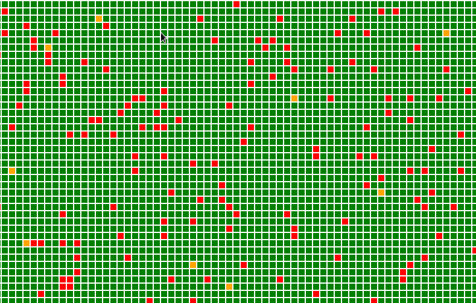

# checkflux

Toying around with a simple visualization for high density dashboards with websockets and golang.

This is one of the first things i wrote in golang, error handling, working with channels, etc is somewhat shitty. Don't judge!
